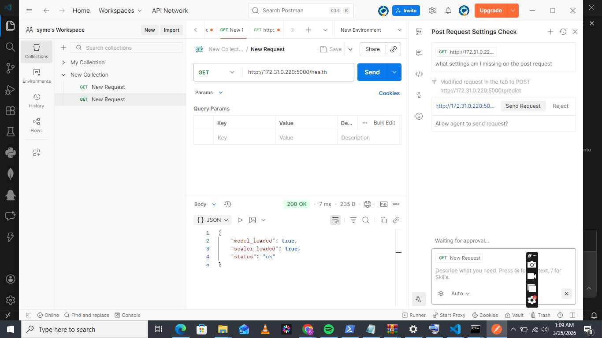
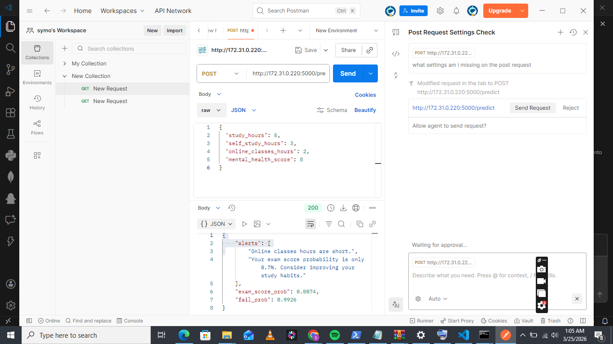
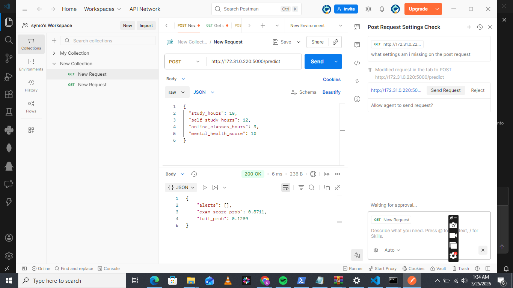

# student_predictor

A new Flutter project.

## Getting Started

This project is a starting point for a Flutter application.

A few resources to get you started if this is your first Flutter project:

- [Learn Flutter](https://docs.flutter.dev/get-started/learn-flutter)
- [Write your first Flutter app](https://docs.flutter.dev/get-started/codelab)
- [Flutter learning resources](https://docs.flutter.dev/reference/learning-resources)

For help getting started with Flutter development, view the
[online documentation](https://docs.flutter.dev/), which offers tutorials,
samples, guidance on mobile development, and a full API reference.
## Get req /health

<!--   -->
## Post /predict raw data =input output=json

{
  "study_hours": 5,
  "self_study_hours": 3,
  "online_classes_hours": 2,
  "mental_health_score": 8
}

<!-- .png>) -->

{
  "study_hours": 10,
  "self_study_hours": 12,
  "online_classes_hours": 3,
  "mental_health_score": 10
}
